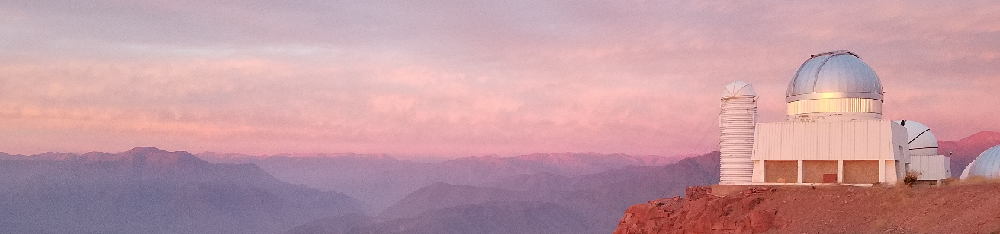

### Hi yall, I'm Taylor!  :telescope:
I'm an astrophysicist and PhD student studying high-redshift galaxies that existed when the Universe was less than 1 billion years old.  I primarily study these galaxies through near-infrared spectroscopy, targeting the emission lines emitted from these galaxies in the ultraviolet (which have redshifted to the near-infrared by the time their light reaches our telescopes).

I code for my research and for some of my serviework, however I also dabble in various mini projects as hobbies.  Feel free to look around and check it out!  You can also learn more about me, my research, and my hobby projects on my website, [aibhleog.github.io](https://tx.ag/taylor).
