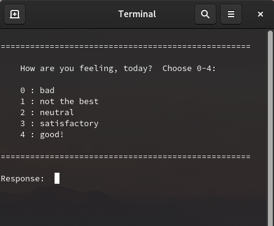

## Hi yall, I'm Taylor!  :telescope:
I'm an astrophysicist and PhD student studying high-redshift galaxies that existed when the Universe was less than 1 billion years old.  I primarily study these galaxies through near-infrared spectroscopy, targeting the emission lines emitted from these galaxies in the ultraviolet (which have redshifted to the near-infrared by the time their light reaches our telescopes).

I code for my research and for some of my servicework, however I also dabble in various mini projects as hobbies.  Feel free to look around and check it out!  You can also learn more about me, my research, and my hobby projects on my website, [aibhleog.github.io](https://tx.ag/taylor).  
  
  
### 🌟 Random project highlight 🌟

  

### [`how-are-you`](https://github.com/aibhleog/how-are-you)?  
I'll change out occasionally which project I'm highlighting in my bio, but for now I want to talk about my `how-are-you` repository!  The main script ([`how-are-you.py`](https://github.com/aibhleog/how-are-you/blob/main/how-are-you.py)) is a Python script that is made to be added at the base of your `.bashrc` or `.bash_profile` so that it can prompt you daily (the first time you open your terminal) to log how you're doing that day.  I made this for myself and anyone who wants to track their mental health over time but knows that they will never be able to keep up with logging it, unprompted.  

The image to the left is an example of what the prompt will look like in your terminal 😀 I've also added two other scripts to the repo -- one which plots your feelings entries versus time ([`see-feelings.py`](https://github.com/aibhleog/how-are-you/blob/main/see-feelings.py)) and one which allows you to change your feeling entry for the day ([`update-feeling.py`](https://github.com/aibhleog/how-are-you/blob/main/how-are-you.py)).  Both of these scripts are meant to be integrated into your `.bashrc` as aliases, so that you can type their alias in the terminal and pop up plots or change your feelings entry without having to track down the file (visit the [`README.md`](https://github.com/aibhleog/how-are-you/blob/main/README.md) for more info on this).
